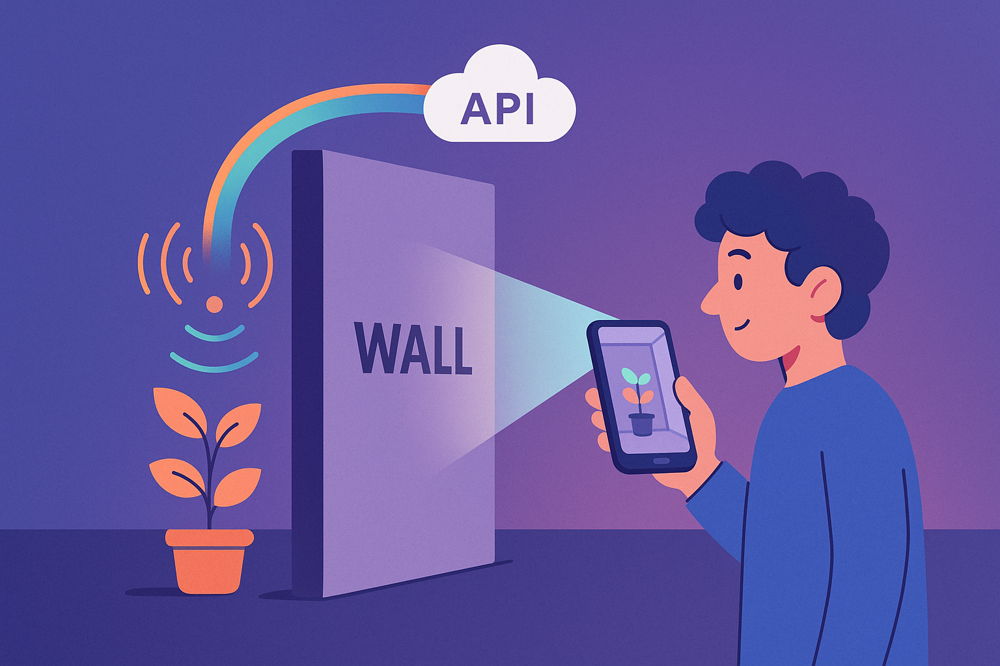
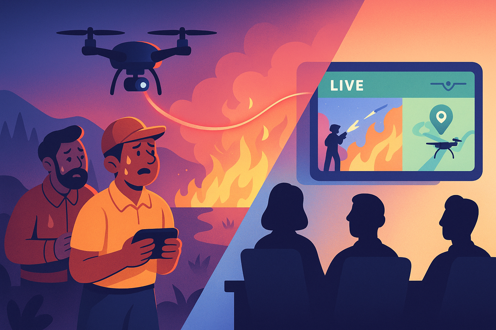

<h1 align="center">🚀 ClearRock – STARS Accomplishments Workbook</h1>

Central hub for documenting professional accomplishments using the <strong>STARS model</strong> 
(<strong>Situation • Task • Actions • Results • Skills/Strengths</strong>). 
This file captures detailed examples of professional, academic, and personal achievements for career development, reflection, and portfolio use.

---

<h2 align="center">🌟 STARS #1: Counter-Human Trafficking Pipeline</h2>

  
   
  <em>Figure 1: Transforming chaos into clarity — a human-centered system for structured insight.</em>

**Accomplishment Statement**  
Sole developer on an internal initiative, where I designed and deployed a modular Python + Docker pipeline with a lightweight React frontend to process and index unstructured investigative data offline. Built reproducible containerized services (Apache Tika, Elasticsearch, Kibana, Nominatim, Apache Joshua, Portainer, etc.), implemented entity and face recognition extraction, and validated the architecture with synthetic persona-based test data. The system accelerated investigative workflows by surfacing relevant evidence metadata in massive, mostly unusable data dumps.  

---

### 1️⃣ Situation
- Internal MIT Lincoln Lab project focused on processing and organizing large investigative datasets.
- Partnered with local law enforcement agency based in New York. 
- Team downsized to just two people: myself (sole developer) and a program manager.  
- Strict constraints: data access restrictions, offline-only operation, reproducible environments.  
- Internal funding required completion of an entrepreneurial validation program.
- Program manager conducted customer discovery interviews with a variety of local law enforcement agencies.
- Personally balancing full-time engineering responsibilities with Boston University online graduate coursework.  

---

### 2️⃣ Task
- Take ownership of the entire repository and deliver a functional end-to-end system.  
- Architect a full pipeline capable of handling multiple document types (text, video, etc.).  
- Ensure modular, reproducible, and offline-ready deployment via containerization.  
- Build a simple frontend for creating “workspaces” (investigations) and running processing jobs.  
- Align development with stakeholder validation interviews conducted by program manager.
- Selecting appropriate software business model.

---

### 3️⃣ Actions
- Designed a modular, Dockerized Python pipeline integrating Apache Tika, Elasticsearch, Kibana, Postgres, and Nominatim.  
- Added machine translation (Apache Joshua) and entity extraction with CoreNLP, spaCy, regex, and face recognition.  
- Created reproducible builds with Docker Compose and implemented automated testing via pytest.  
- Collaborated on synthetic datasets to simulate investigations while protecting sensitive data.  
- Shadowed the program manager during stakeholder validation sessions.
- Decided to pursue hybrid open source business model.

---

### 4️⃣ Results
- Delivered a functional prototype validated by law enforcement and NGO partners.  
- Proved reproducible offline systems viable for secure environments.  
- Gained experience in full-stack design, NLP, and container orchestration.  

---

### 5️⃣ Skills / Job Knowledge
Python • React • Docker • Elasticsearch • Kibana • Apache Tika • Nominatim • Postgres • NLP • pytest  

---

### 6️⃣ Personal Strengths
Resilience • Initiative • Mission-Driven Focus • Systems Thinking • Adaptability  

---

<h2 align="center">🌟 STARS #2: Rapid Android Prototype (See-Through-Wall Sensor App)</h2>

  
   
  <em>Figure 2: Turning invisible signals into visible insight — real-time sensor data visualization around physical barriers.</em>

**Accomplishment Statement**  
Joined a time-sensitive Android sensor project for a one-month sprint to modernize and complete an experimental “see-through-wall” visualization prototype. Updated the codebase to modern Android design patterns, optimized sensor data rendering, and delivered a working demo that unblocked the next phase of research.  

---

### 1️⃣ Situation
- R&D project visualizing wall-penetrating sensors through Android interfaces.  
- High-pressure timeline; minimal documentation.  

### 2️⃣ Task
- Modernize app, integrate data visualization, and ensure demo reliability.  

### 3️⃣ Actions
- Refactored Android code with new SDKs and architecture components.  
- Integrated sensor data pipeline via API; designed visualization layer for wall data.  
- Developed a working prototype with real-time rendering of detected objects.  

### 4️⃣ Results
- Delivered a stable and visually intuitive demo within one month.  
- Improved compatibility, performance, and data flow clarity.  

### 5️⃣ Skills / Job Knowledge
Android • Java • Kotlin • API integration • Real-time visualization  

### 6️⃣ Personal Strengths
Adaptability • Focus • Technical Agility • Rapid Problem Solving  

---

<h2 align="center">🌟 STARS #3: NICS / NATO National Exercise – Live Feed Fix</h2>

  
   
  <em>Figure 3: Calm under fire — real-time troubleshooting and composure during live mission-critical operations.</em>

**Accomplishment Statement**  
During a live NATO-sponsored national exercise, restored the real-time drone video feed used by senior officials after identifying and correcting a single-character error in the controller’s configuration. The fix re-established situational awareness within minutes and saved the demonstration from failure.  

---

### 1️⃣ Situation
- Field engineer during a live exercise; the main video feed failed before demonstration.  

### 2️⃣ Task
- Restore live video feed and telemetry in real time.  

### 3️⃣ Actions
- Diagnosed root cause under pressure, discovered URL typo, corrected and deployed fix.  

### 4️⃣ Results
- Restored mission-critical feed within minutes, ensuring event success.  

### 5️⃣ Skills / Job Knowledge
Android • Network configuration • Field debugging • System monitoring  

### 6️⃣ Personal Strengths
Composure • Precision • Communication • Initiative  

---

<h2 align="center">🌟 STARS #4: Universal Dev Environment Setup</h2>

  
   
  <em>Figure 4: Structure and serenity — connecting Docker, VSCode, React, FastAPI, and MegaLinter in one reproducible workspace.</em>

**Accomplishment Statement**  
Designed and implemented a universal container-based development environment to reduce context switching, automate setup, and maintain productivity across multiple projects. Integrated Docker, VSCode Dev Containers, Taskfile, Poetry, and MegaLinter for reproducible, local-first development.  

---

### 1️⃣ Situation
- Frequent context switching between differing project stacks caused friction and burnout.  

### 2️⃣ Task
- Build a unified dev setup that worked across systems and tools.  

### 3️⃣ Actions
- Created base Docker images for modular reusability.  
- Automated builds and linting pipelines with Taskfile and MegaLinter.  
- Integrated FastAPI, React, and Postgres in reproducible containers.  

### 4️⃣ Results
- Reduced setup time from hours to minutes.  
- Improved development hygiene, focus, and sustainability.  

### 5️⃣ Skills / Job Knowledge
Docker • VSCode • FastAPI • React • MegaLinter • DevOps  

### 6️⃣ Personal Strengths
Discipline • Systems Thinking • Process Design • Self-Awareness  

---

<h2 align="center">🌟 STARS #5: Incompris LLC – Creative-Technical Studio</h2>

  
   
  <em>Figure 5: Cosmic creativity — the interconnected constellation of music, AI, design, and automation under one unified system.</em>

**Accomplishment Statement**  
Founded **Incompris LLC**, a creative-technical studio merging systems architecture, automation, and AI with music and design. Built an adaptive, self-regulating creative ecosystem that merges engineering discipline with artistic freedom.  

---

### 1️⃣ Situation
- Desired a scalable framework merging creative and technical workflows.  

### 2️⃣ Task
- Design an autonomous system connecting music, AI, design, and automation.  

### 3️⃣ Actions
- Created a multi-node architecture (Audiora) to map tools and workflows.  
- Automated content production with Ableton, Suno, Splice, RunwayML, and Zapier.  
- Deployed analytics-driven release and feedback systems.  

### 4️⃣ Results
- Produced 150+ tracks with visual and technical automation.  
- Built a reproducible model of creative workflow design.  

### 5️⃣ Skills / Job Knowledge
Systems Architecture • AI • Automation • Creative Production  

### 6️⃣ Personal Strengths
Vision • Innovation • Emotional Intelligence • Integration • Leadership  

---
